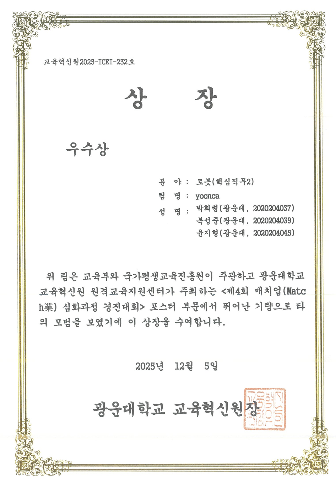

# Raspberry Pi 임베디드 인공지능 시스템 최적화
### Embedded AI System Optimization Project

본 프로젝트는 **광운대학교 "임베디드 인공지능 시스템 최적화" 과목**에서 수행한 자율주행 RC카 프로젝트입니다.  

라즈베리파이 5 환경에서 **차선 인식(OpenCV)과 객체 인식(YOLO)을 결합하여 실시간 주행 제어 시스템**을 구현하였습니다.  
제한된 엣지 디바이스 환경에서 **실시간 추론, 멀티스레딩 구조, 상태 기반 제어 시스템**을 적용하여 안정적인 자율주행을 목표로 설계되었습니다.


## Demo

🎥 **주행 시연 영상**

[YouTube Demo Video](https://youtu.be/LoUIbfHKj1g)

---

# Result

🏆 **프로젝트 수상**



- 실무 보고서 부문 장려상
  
- 포스터 부문 우수상  

---

# Project Overview

최근 AIoT 기술과 엣지 컴퓨팅 환경의 발전으로 소형 장치에서도 AI 기반 인식과 제어가 가능해졌습니다.  
하지만 RC카와 같은 배터리 기반 소형 시스템에서는 **연산 자원과 전력 소비가 제한적**이기 때문에 효율적인 시스템 설계가 필요합니다.

본 프로젝트에서는 다음 목표를 중심으로 자율주행 시스템을 설계하였습니다.

- 라즈베리파이 환경에서 실시간 객체 인식 수행
- 영상 처리 기반 차선 추종 알고리즘 구현 및 안정적인 주행
- 안정적인 객체 인식 수행

---

# Key Features

- OpenCV 기반 **노란 차선 인식**
- YOLO 기반 **교통 표지판 인식**
- **State Manager 기반 주행 상태 제어**
- 멀티스레딩 기반 **비동기 객체 인식**
- 라즈베리파이 환경에서 **실시간 주행 제어**
- 차선 분실 시 **자동 복구 알고리즘**
- 이벤트 기반 **부저 제어**

---

# Driving Logic

## Lane Detection

차선 인식은 HSV 색상 공간에서 노란색 채널을 추출하는 방식으로 구현되었습니다.  
HSV 색상 공간은 조명 변화에 강건하기 때문에 야외 환경에서도 안정적인 차선 검출이 가능합니다.

차선 검출 과정:

1. 영상 하단 ROI 설정
2. HSV 변환
3. 노란색 범위 마스킹
4. 노이즈 제거
5. 가장 큰 윤곽선 선택
6. 차선 edge 좌표 계산

차량은 검출된 차선 좌표를 기반으로 **차선 중앙이 아닌 일정 offset 위치를 목표 경로로 설정**하여 안정적인 주행을 수행합니다.


## Steering Control

조향 제어는 **임계값 기반 제어 방식**을 사용합니다.

1️⃣ 목표 지점 계산  

차선 좌표 + offset을 적용하여 차량이 유지해야 할 목표 위치를 계산합니다.

2️⃣ 오차 계산  

목표 위치와 화면 중심의 차이를 계산합니다.

3️⃣ 조향 결정  

| 조건 | 동작 |
|-----|-----|
| \|error\| < dead zone | 직진 |
| error > 0 | 우회전 |
| error < 0 | 좌회전 |

이 방식은 연산량이 적어 **임베디드 환경에서 빠른 반응성을 제공**합니다. 


## State Manager

StateManager는 차량의 행동을 관리하는 **유한 상태 머신(FSM)** 입니다.

| State | Description |
|------|-------------|
| Go | 기본 주행 |
| Stop | 정지 표지판 / 적색 신호 |
| Slow | 서행 구간 |
| Trumpet | 경적 표지판 |
| Left / Right | 방향 전환 |

객체 인식 결과에 따라 StateManager가 차량의 동작 파라미터를 변경합니다.

## Multithreading Architecture

객체 인식은 연산량이 많기 때문에 **모터 제어 루프를 방해할 수 있습니다.**

이를 해결하기 위해 시스템은 **멀티스레딩 구조**로 설계되었습니다.

하지만 파이썬 특성상 Global interpreter lock으로 인해 병렬구조의 효과는 크게 보지 못하였습니다. 추후 C++로 변경시 보안 가능합니다.

### Main Thread

- 차선 인식
- 상태 업데이트
- 조향 계산
- 모터 제어

### Object Detection Thread

- YOLO 객체 인식 수행

두 스레드는 **threading.Lock을 이용하여 데이터 동기화**를 수행합니다. :contentReference[oaicite:6]{index=6}

이 구조를 통해 **AI 추론과 차량 제어가 동시에 수행될 수 있도록 구현했습니다.**

---

## Lane Recovery Algorithm

차선이 일시적으로 사라지는 경우 차량이 급격히 방향을 바꾸지 않도록 **복구 알고리즘**을 적용했습니다.

1️⃣ 차선 미검출 발생  

일정 프레임 동안 저속 직진 유지

2️⃣ 차선 복구 실패  

이전 추종 방향 기준으로 천천히 이동

3️⃣ 차선 재탐색  

차선을 다시 찾으면 정상 주행 복귀

이 방식은 **차선 끊김 상황에서도 안정적인 주행을 유지**하는 데 중요한 역할을 합니다.


---

# Object Detection method

자율주행 환경에서는 객체 인식 결과가 매 프레임마다 변할 수 있으며,  
일시적인 오검출(false detection)이나 노이즈로 인해 차량이 불필요한 행동을 수행할 수 있습니다.

이를 방지하기 위해 본 시스템에서는 **객체 인식 결과에 대한 필터링 로직을 적용하여 안정적인 상태 전환을 수행하도록 설계했습니다.**

## Detection Stability Filtering

객체가 인식되었다고 해서 즉시 차량의 상태를 변경하지 않고,  
다음과 같은 조건을 만족할 때만 유효한 탐지로 판단합니다.

1️⃣ **Confidence Threshold**

객체 탐지 confidence가 일정 값 이상일 때만 후보로 인정합니다.

```
conf > threshold
```

이를 통해 신뢰도가 낮은 탐지 결과를 제거합니다.

---

2️⃣ **Bounding Box Size Filtering**

멀리 있는 표지판은 실제 주행 이벤트와 관계없는 경우가 많기 때문에  
바운딩 박스의 크기를 기준으로 필터링합니다.

```
bbox_width > min_size
```

객체가 충분히 가까워졌을 때만 이벤트로 처리합니다.

---

3️⃣ **Temporal Filtering (Frame Voting)**

단일 프레임에서 탐지된 결과는 노이즈일 가능성이 있으므로  
최근 여러 프레임의 결과를 기반으로 다수결 방식으로 판단합니다.

예시

```
최근 4 프레임 중
3 프레임 이상 동일 객체 탐지 → 유효한 객체로 판단
```

이 방식은 일시적인 검출 오류로 인해 차량이 갑자기 정지하거나  
방향을 변경하는 문제를 방지합니다.

---

## Filtering Pipeline

```
YOLO Detection
      ↓
Confidence Filter
      ↓
Bounding Box Size Filter
      ↓
Frame Voting Filter
      ↓
Valid Detection
      ↓
State Manager Update
```

---

## Effect

이러한 필터링 구조를 통해 다음과 같은 효과를 얻을 수 있습니다.

- 일시적인 오검출에 의한 **불필요한 상태 전환 방지**
- 멀리 있는 객체에 대한 **조기 반응 방지**
- 실제 주행 상황에서 **안정적인 이벤트 처리**

결과적으로 차량은 **의미 있는 거리에서 안정적으로 표지판을 인식하고 행동을 수행**하게 됩니다.

---

# Tech Stack

## Hardware

- Raspberry Pi 5

## Software

- Python
- OpenCV
- Ultralytics YOLO
- gpiozero
- NumPy
- Roboflow

---

# Dataset

객체 인식 데이터셋은 직접 수집한 약 **2900장의 이미지**를 기반으로 구축되었습니다.  
Roboflow 플랫폼을 활용하여 표지판 및 신호등에 대한 바운딩 박스 라벨링을 수행했습니다.

또한 다음과 같은 데이터 증강을 적용하여 학습 데이터를 확장했습니다. 이때, 강건성을 위해 색상에 대한 강한 증강을 적용하였습니다.

- 밝기 변화
- 노이즈
- 블러
- 위치 이동
- 크기 변형

이를 통해 최종적으로 **약 4400장 규모의 학습 데이터셋**을 구축했습니다.
📦 Dataset
[Roboflow Dataset Link](https://app.roboflow.com/yolood-1izb8/yolo_final-fcjgt/browse?queryText=&pageSize=50&startingIndex=0&browseQuery=true)

---

# Project Structure

```
project/
│
├─ main.py              # 전체 시스템 실행 (카메라 입력 → 차선 검출 → YOLO 이벤트 → 상태 머신 → 모터 제어)
├─ main_run.py          # 실제 주행 실행 스크립트 (전체 모듈 통합 실행)
│
├─ config.py            # 시스템 설정값 관리 (속도, YOLO 추론 주기, 정지 시간 등)
│
├─ motor.py             # GPIO 기반 모터 제어 모듈 (전진, 좌회전, 우회전, 정지)
├─ buzzer.py            # 부저 제어 모듈 (trumpet 표지판 인식 시 경적 재생)
│
├─ mycamera.py          # Raspberry Pi 카메라 입력 모듈
│
├─ rule_lane.py         # OpenCV 기반 노란 차선 검출 및 라인 추종 제어
├─ safe.py              # 주행 안전 보조 로직 (라인 분실 / 안전 정지 처리)
│
├─ yolo_worker.py       # YOLO 객체 인식 모듈 (별도 스레드 기반 실시간 추론)
├─ state_manager.py     # 객체 인식 결과 기반 상태 머신 관리
│                        (STOP / SLOW / LEFT / RIGHT / STRAIGHT / GREEN 등)
│
├─ visualizer.py        # 디버그 시각화 모듈
│                        (차선 위치, YOLO 검출 박스, 상태 텍스트 출력)
│
├─ README.md            # 프로젝트 설명 문서
│
└─ model/
    │
    ├─ best_strong4.pt  # 학습된 YOLO 모델 weight
    │
    ├─ EDA.ipynb        # 데이터 탐색 및 분석 노트북
    ├─ modeling.ipynb   # YOLO 학습 및 모델 실험 노트북
    └─ model_test.ipynb # 모델 성능 테스트 및 추론 확인
```

---

# Team

광운대학교 데이터사이언스  

- 복성준  
- 윤지형  
- 박희령


